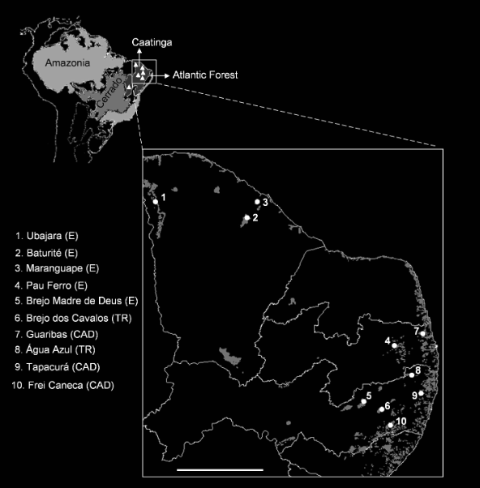
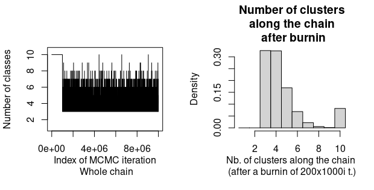
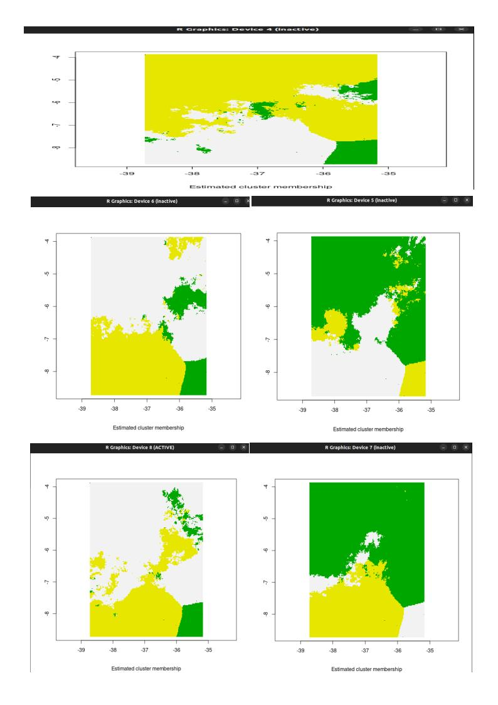
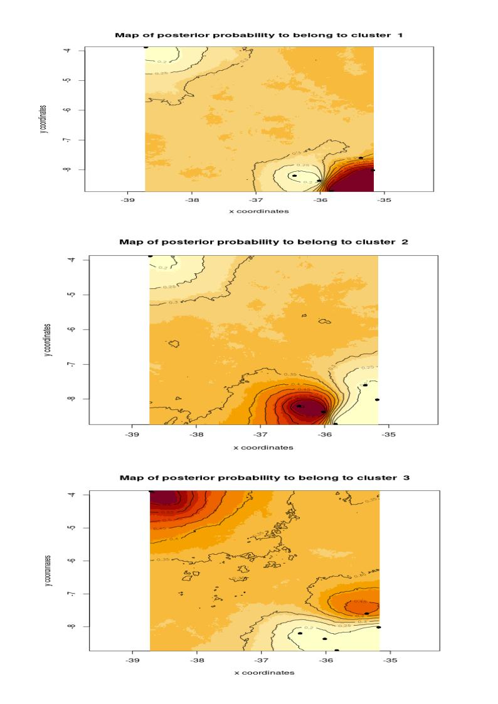

# Filogeografia

Objetivo:
Este relatório, elaborado para a disciplina de Filogeografia, tem como objetivo descrever as etapas envolvidas na aplicação prática de ferramentas de bioinformática em análises filogeográficas. Dados de sequenciamento genético multilocus obtidos através do trabalho (CARNAVAL; BATES, 2007), foram utilizados para realizar as seguintes análises: construção de árvores filogenéticas, delimitação de linhagens, avaliação da diversidade genética, análise da estrutura populacional e reconstrução da história demográfica da nossa espécie modelo.

1. Download e limpeza dos dados.

Um script personalizado em python("Search_ncbi_and_clear_data.ipynb") foi utilizado para baixar as sequências de DNA no formato *.fasta através de um intervalo de código de acesso do GenBank (“https://www.ncbi.nlm.nih.gov/), e limpar os cabeçalhos de modo que a identificação de cada voucher fosse preservado e as sequências estivessem prontas para realizar o alinhamento separadamente para cada sequência, o Script está disponível no Github (https://github.com/nathanufpb/Phylogeogra.git). Os dados incluem os genes mitocondriais NADH dehydrogenase 2 (ND2) e o Citocromo b (Cytb), além do gene nuclear proto-oncogene MYC, fator de transcrição bHLH (c-myc).

2. Alinhamento e Faseamento.

Realizamos o alinhamento de cada sequência separadamente utilizando o algoritmo Muscle (EDGAR, 2004) através do software MEGA 11 (TAMURA; STECHER; KUMAR, 2021) Figura 1. Utilizamos o algoritmo PHASE (STEPHENS; DONNELLY, 2003; STEPHENS; SMITH; DONNELLY, 2001) para separar as fases haplotípicas do gene nuclear c-myc  utilizando a 5ª versão do software DnaSP (LIBRADO; ROZAS, 2009), obtendo o conjunto de diferentes alelos herdados juntos em um mesmo cromossomo (Figura 2). Um corte nas phases com similaridades abaixo de 60% foi realizado na sequência de alinhamento do gene c-myc utilizando o script python remove_low_phases.ipynb escrito no formato Júpiter Notebook contido no diretório do github, restaram 80 sequências (fases diferentes) no total.
Em contrapartida, os genes mitocondriais ND2 e Cytb não foram submetidos a esse processo, uma vez que sua herança exclusivamente materna torna o faseamento desnecessário.

3. Seleção de Modelos

Utilizamos o Jmodeltest (DARRIBA et al., 2012; POSADA, 2008) para testar quais modelos de substituição nucleotídica se adequam melhor aos nossos dados de sequências alinhadas (Figura 4). Os resultados são mostrados na Tabela 1.

4. Árvores de Genes

Utilizamos uma abordagem bayesiana para calcular árvores filogenéticas através do software  BEAST2 (BOUCKAERT et al., 2014). Primeiramente as sequências foram carregadas através do BEAUTI2 onde foram especificados cada modelo para cada sequência (Figura 5). Em seguida a análise seguiu utilizando o BEAST2 (Figura 6).

O programa Tracer versão 1.7.2 (RAMBAUT et al., 2018) foi utilizado para verificar o status e o resultado da análise bayesiana incorporando o arquivo de *.log gerado pelo output do BEAST2 (Figura 7).

Em seguida, o software Treeannotator (BOUCKAERT et al., 2014) juntamente com o BEAST2 foi utilizado para gerar uma árvore de consenso das árvores geradas (Figura 8). Após o consenso, a árvore foi editada para melhor visualização utilizando o Figtree versão 1.4 (Figura 9).

5. Inferência da Estrutura Populacional

GeneLand

Geneland é um pacote escrito em linguagem R que permite fazer uso de genótipos multilocus individuais georreferenciados para a inferência do número de populações e da localização espacial de descontinuidades genéticas entre essas populações. As principais suposições do método são: (i) o número de populações é desconhecido e todos os valores são considerados a priori igualmente prováveis, (ii) as populações são espalhadas por áreas dadas por uma união de alguns polígonos de localização desconhecida no domínio espacial, (iii) o equilíbrio de Hardy-Weinberg é assumido dentro de cada população e (iv) as frequências de alelos em cada população são desconhecidas e tratadas como variáveis aleatórias seguindo o chamado modelo de Dirichlet ou modelo de Falush [(GUILLOT; MORTIER; ESTOUP, 2005)](https://www.zotero.org/google-docs/?oUPvZg).

Utilizamos o Geneland para verificar se existe estrutura populacional na espécie Procerathrophys boiei coletada ao longo do nordeste brasileiro sob brejos de altitude por Carnaval 2007.

A análise do Geneland começou criando pastas para os genes nucleares phaseados e separados em 2 exons e 1 intron, e uma pasta para os dois outros genes mitocondriais.

os scripts em python dentro da pasta Geneland/Scripts (fasta2haplotype_matrix_mitocondrial.py e fasta2haplotype_matrix_nuclear_gen.py)
foram utilizados para transformar os dados .fas em uma matriz haplotípica.

o script "Configure_txt_file_and_create_coordenate_file.ipynb" foi utilizado para criar um novo arquivo da matriz haplotípica dos genes mitocondriais contendo apenas as linhas que possuiam o mesmo código do gene nuclear(42 genes), e na construção de um arquivo contendo as coordenadas de cada linha mapeada para os códigos do arquivo nuclear.

o novo arquivo dos genes mitocondriais com o mesmo número de amostras e o mesmo código do arquivo com genes nucleares:

mt.temp = filtered_mitochondrial_data_no_header.txt

geno.temp = Proceratophrys_boiei_matrix_sorted_nuclear_no_individual_column_NEW.txt

coord.temp = Proceratophrys_boiei_haplotype_matrix_sorted_nuclear_with_individuals_NEW_geo.txt

maindir = /home/nathan/Documents/Doutorado_diversidade_genética/Phylogeogra/Geneland/Scripts/Geneland_analysis/   #defina um diretório

Com esses arquivos foi possível executar o Geneland através dp Rscript "Geneland_Cnemis.R"

O Programa estimou três populações evolutivamente separadas entre PE e CE e entre PB e PE mas as probabilidades permaneceram baixas

7. Estimativas genéticas, Análise de variância molecular (AMOVA) e Redes de haplótipos

   Foi estimada a diversidade genética do Procerathrophys boiei utilizando o script (/home/nathan/Documents/Doutorado_diversidade_genética/Phylogeogra/DnaSP/Script_Python_statistics/Estatistica_Sumaria_final.py)

   O resultado está em /home/nathan/Documents/Doutorado_diversidade_genética/Phylogeogra/DnaSP/Script_Python_statistics/Tabela_formatada_1.pdf
